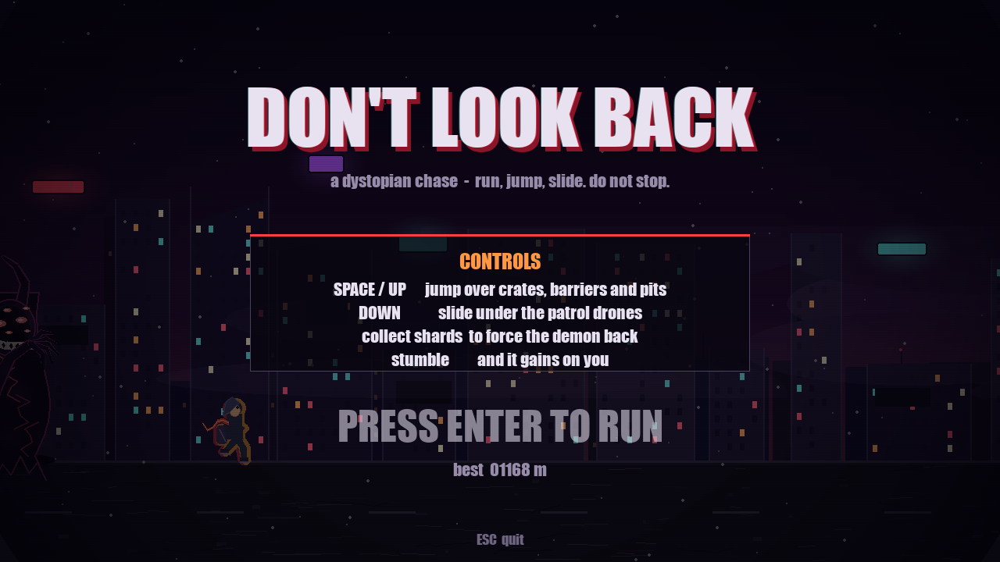
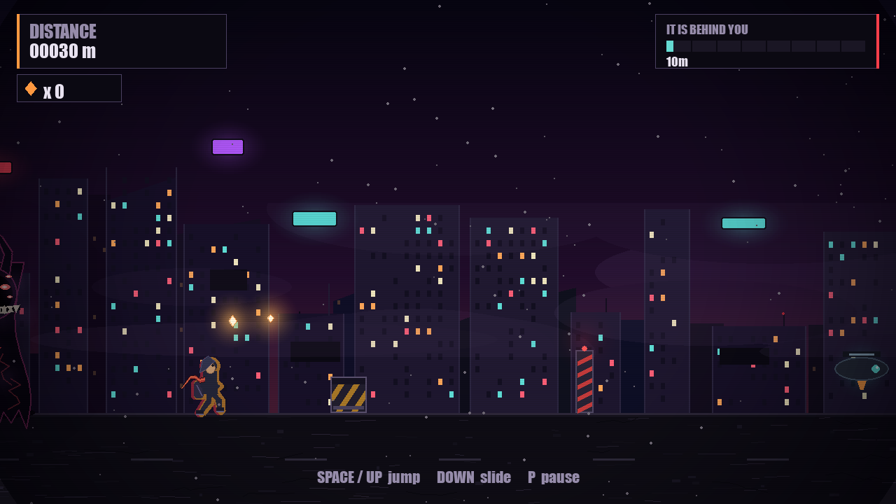
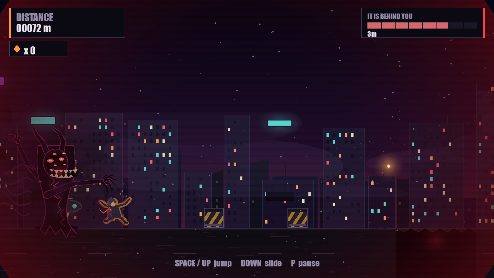
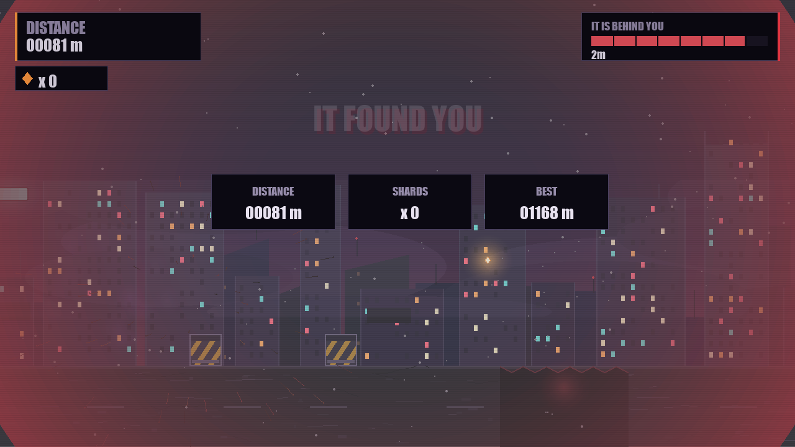

# Don't Look Back

A simple but mind-blowing 2D game made with Python.

## How to Play
- SPACE / UP: jump over crates, barriers and pits
- DOWN: slide under the patrol drones
- Collect shards to force the demon back
- Stumble and it gains on you
- ENTER: start the run
- ESC: quit

## Screenshots

### Menu

### Gameplay

### Chase

### Caught

## How to Run
1. Download `DontLookBack.exe` and double-click it
   OR
2. Install Python, then run `python game.py`

## Made By
Zaidi-maker
